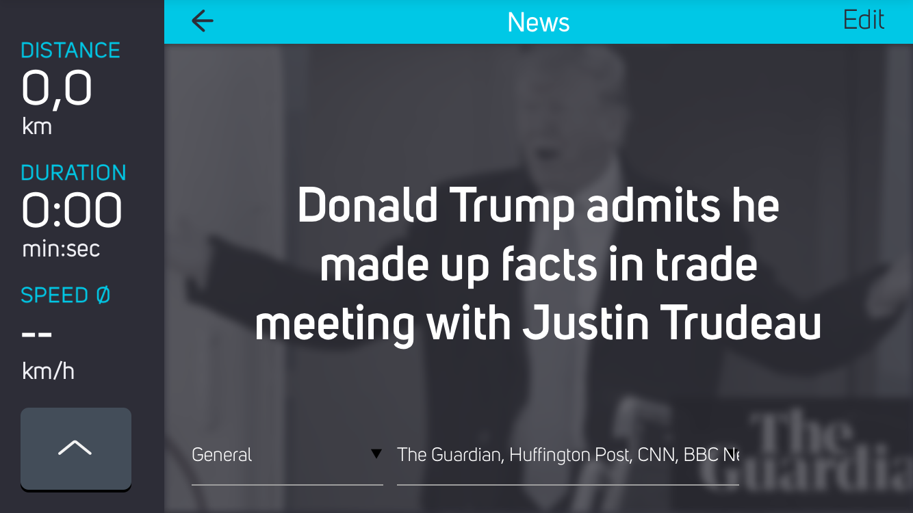

# News DevKit module for COBI.bike
[](https://app.fossa.io/projects/git%2Bgithub.com%2Fcobi-bike%2FModule-News?ref=badge_shield)


The DevKit module "News" displays the latest news headlines, based on the personal interest and allows you to add them to your read later list.
It's part of a collection of Open Source [modules](https://cobi.bike/devkit) for the [COBI.bike](https://cobi.bike) system.



## Quickstart: Interactive Demo

The quickest way to test the module via [Glitch.com](https://glitch.com):

[](https://glitch.com/edit/#!/import/github/cobi-bike/Module-News)

Glitch.com allows you to edit, host and fork Node.js applications for quick prototyping.
Follow the [installation step 2 to 3](#installation-and-setup) and copy the environment variables to the: `.env` file on Glitch.com

## Overview
This module utilizes [Newsapi.org](https://newsapi.org/register) to poll the latest news from various news outlets.
The Node.js backend acts as a Newsapi.org proxy and serves a static page to the client, which allows the user to switch between headlines, read its description and add it to his read-later list.

## Installation and Setup

You can easily deploy the module on your own:

### Step 1: Clone repository

Clone this repository and install Node.js dependencies with:

``` bash
npm install
```  

### Step 2: Create a Newsapi.org account

This module relies on [Newsapi.org](https://newsapi.org/register) to poll the latest news from various news outlets. Create an account and retrieve your api key.

### Step 3: Set environment variables

Set the environment variable `NEWSAPI_KEY` with your credentials for newsapi.org


### Step 4: Run Node.js server

The module is accessible under [localhost:3000](http://localhost:3000/) after starting the Node.js server with:
``` bash
NEWSAPI_KEY=... node server.js
```  
The settings menu can be accessed with the [?state=edit](http://localhost:3000/?state=edit) suffix.

### _Optional_: Install COBI.bike DevKit Simulator

Follow the [instructions](https://github.com/cobi-bike/DevKit#-test-your-module) to install the COBI.bike Google Chrome Simulator and get familiar with the basics of module development on the COBI plattform.

## Useful DevKit links

* [Debugging Tips & Tricks](https://github.com/cobi-bike/DevKit#debugging-tips--tricks)
* [Inspiration & Examples](https://github.com/cobi-bike/DevKit#inspiration--examples)
* [Interface Guidelines](https://github.com/cobi-bike/DevKit#interface-guidelines)
* [More DevKit Resources](https://github.com/cobi-bike/DevKit#inspiration--examples)
* [Other Tools & Resources](https://github.com/cobi-bike/DevKit#other-tools--resources)


## Contributing to this project

Anyone and everyone is welcome to contribute to this project, the [DevKit Simulator](https://github.com/cobi-bike/DevKit-Simulator) and the [DevKit UI Components](https://github.com/cobi-bike/DevKit-UI). Please take a moment to review the [guidelines for contributing](https://github.com/cobi-bike/DevKit/blob/master/CONTRIBUTING.md).

* [Bug reports](https://github.com/cobi-bike/DevKit/blob/master/CONTRIBUTING.md#bugs)
* [Feature requests](https://github.com/cobi-bike/DevKit/blob/master/CONTRIBUTING.md#features)
* [Pull requests](https://github.com/cobi-bike/DevKit/blob/master/CONTRIBUTING.md#pull-requests)

Copyright © 2018 COBI.bike GmbH


## License
[](https://app.fossa.io/projects/git%2Bgithub.com%2Fcobi-bike%2FModule-News?ref=badge_large)